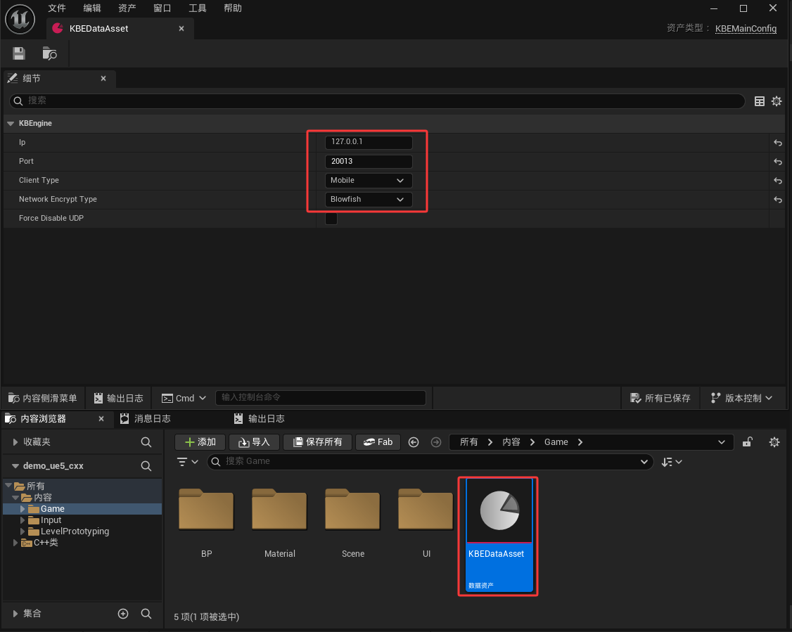
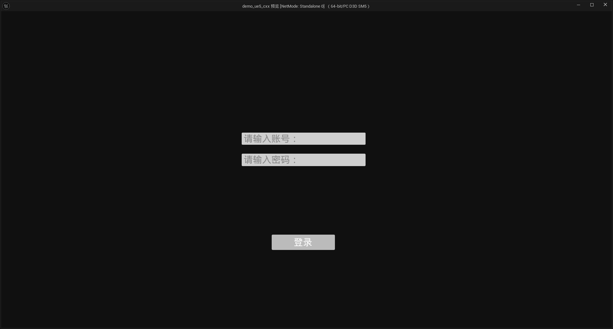
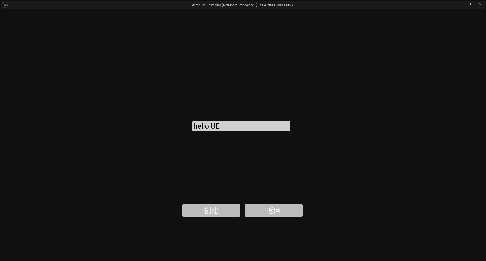
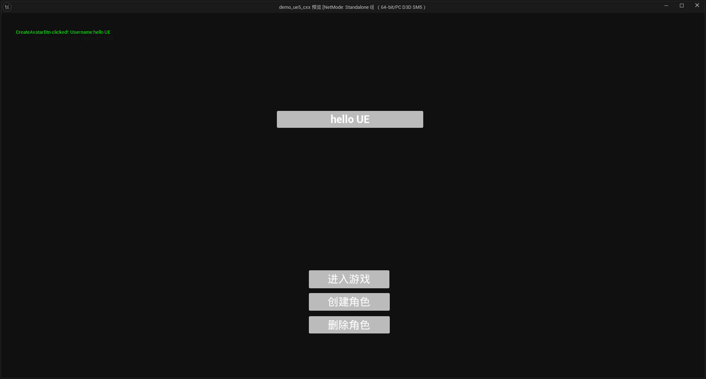

请注意：
- 因为和UE5_default DEMO重复，所以本DEMO并未完成所有功能。
- SDK 依赖Libhv ，请自行编译引入项目（当然SDK中已经提供了对应的DLL、头文件），DEMO中也做了Libhv的接入，详情请看ThirdParty/LibhvModule
- 目前仅在windows下测试，其他平台待测试

已完成功能：

- 登录
- 注册
- 创建角色
- 选择角色
- 进入游戏
- 实体生成、同步


# DEMO使用流程
- 安装UE
- 安装VS
- 下载DEMO
- demo_ue5_cxx.uproject 右键 -> Generate Visual Studio Project File
- 打开demo_ue5_cxx.sln 解决方案
- 生成SDK（可选）
    - gensdk.bat（start "" "%KBE_BIN_PATH%/kbcmd.exe" --clientsdk=cxx --outpath="D:\Workspace\UnrealProjects\demo_ue5_cxx\Source\demo_ue5_cxx\kbengine_cxx_plugins"）
- 编译运行


# DEMO 思路解析

### GameKBEMain

GameKBEMain是一个UE管理的 UGameInstanceSubsystem (全局单例)，用于管理KBEngine的生命周期以及SDK的初始化

- 子系统的生命周期管理
  - 在 Initialize 中注册多个事件监听器，并启动一个 ticker 来持续调用 KBEngine::process() 处理网络消息。
  - 在 Deinitialize 中注销所有事件并清理资源。
- 定时处理网络消息
  - 使用 FTSTicker::GetCoreTicker().AddTicker 添加每帧执行的回调函数 Tick。
  - 在 Tick 函数中调用 KBEngine::KBEngineApp::getSingleton().process()，确保在网络主线程中处理来自服务器的消息。
- 配置初始化
  - 提供 InitWithConfig 方法，根据 Config 对象中的参数初始化 KBEngine 客户端连接信息，例如 IP 地址、端口等。
- 事件监听
  - 地图切换：addSpaceGeometryMapping
  - 被踢出服务器：onKicked
  - 断开连接：onDisconnected
  - 连接状态变更：onConnectionState
  - 版本不匹配提示：onVersionNotMatch, onScriptVersionNotMatch
  - 登录流程相关反馈：onLoginBaseapp, onLoginFailed, onLoginBaseappFailed, onReloginBaseappSuccessfully, onLoginSuccessfully
- 暂停/恢复事件系统
  - 提供 KBEngineEventPause 和 KBEngineEventResume 方法，在场景切换期间控制事件系统的启停。
- 地图加载与切换
  - 在 addSpaceGeometryMapping 回调中通过 UGameplayStatics::OpenLevel 加载新关卡，同时暂停事件派发直到新场景准备就绪。


### 配置IP、端口

UE中，可在KBEDataAsset配置端口、IP、加密等信息

BP_StartGameMode中会对配置进行初始化填充，详情请看BP_StartGameMode




### 创建实体文件
```c++
#include "NPC.h"

#include "../kbengine_cxx_plugins/Entity.h"
#include "LogicEvents.h"
#include "WorldGameMode.h"

#include "../kbengine_cxx_plugins/EntityFactory.h"
#include "Character/NPCCharacter.h"

class ANPCCharacter;

namespace KBEngine
{
NPC::NPC():
	NPCBase()
{

}

NPC::~NPC()
{

}


}


namespace {
	const bool registeredNPC = []() {
		EntityFactory::instance().registerType("NPC", []() {
			return new KBEngine::NPC();
		});
		return true;
	}();
}
```

### 角色位置上传

`APlayerCharacter` Tick 中，请注意KBEngine和UE的坐标系转换

```c++
void APlayerCharacter::Tick(float DeltaTime)
{
	Super::Tick(DeltaTime);

	// 上传Player位置
	FVector PlayerLocation = GetActorLocation();
	KBEngine::Entity* kbe_player = KBEngine::KBEngineApp::getSingleton().player();
	kbe_player->position.x = PlayerLocation.Y / 100.f;
	kbe_player->position.y = PlayerLocation.Z / 100.f;
	kbe_player->position.z = PlayerLocation.X / 100.f;

	// 上传Player朝向
	FRotator PlayerRotation = GetActorRotation();
	kbe_player->direction.x =  FMath::DegreesToRadians<float>(PlayerRotation.Roll);
	kbe_player->direction.y =  FMath::DegreesToRadians<float>(PlayerRotation.Pitch);
	kbe_player->direction.z =  FMath::DegreesToRadians<float>(PlayerRotation.Yaw);
}
```


### UI创建
在 Lv_Start场景的关卡蓝图中实例化 BP_Login，BP_Login有对应的 C++ 类（LoginWidget）

# 截图

## 登录页面



## 注册页面


## 选择角色页面


## 进入游戏页面


## 多玩家在线
